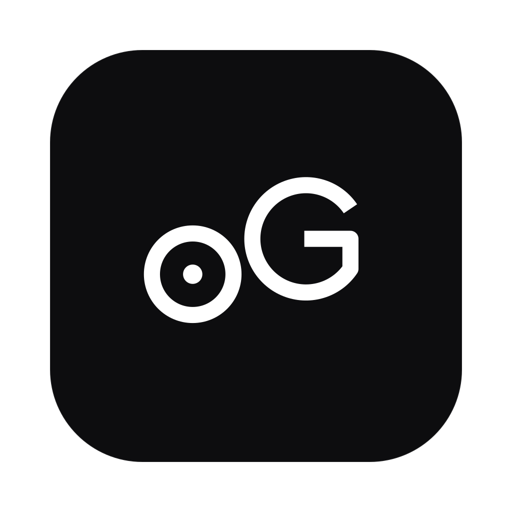
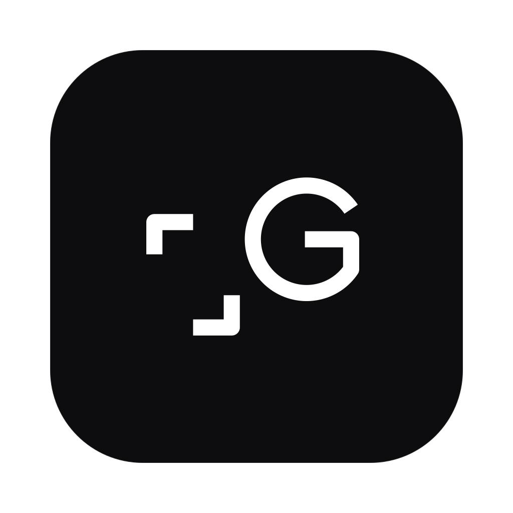

  

# AI Family

The site for a family of AI models built from scratch — [Gzowo AI](https://github.com/JerzySukiennik/gzowo-ai), [MicroG](https://github.com/JerzySukiennik/microg) and Gedit.

One long page, no nav bar. A hero with an orbiting carousel of the model marks, the reasoning behind the family, the shared construction grid the three logos are drawn on, MicroG's measured benchmarks, and a full section per model.

**Live:** https://jerzysukiennik.github.io/ai-family/

## Design

No colour. Not an omission — Gzowo AI's own spec makes black and white a rule, so the family site keeps it. Status is carried by a glyph rather than a hue: `●` live, `◐` built but not finished, `○` spec only.

Type is `system-ui` (SF Pro on the machines this targets, which already ships Apple's optical sizing and tracking) paired with JetBrains Mono for labels, numbers and status — the same utility face Gzowo AI specifies for its own HUD.

The signature section is *One family, one grid*: the three marks drawn on their real shared construction grid, with the measurements taken from the comments in the source SVGs. Stroke weight 15, baseline 140, x-height 74, descender 172, and a G at centre 200,90 radius 50 that is literally the same path in all three files.

## Adding a model

Everything is generated from one array. Add an entry to [`js/models-data.js`](js/models-data.js) and the orbit, the readout, the anchor links, the section and the footer link all follow. No code in `js/main.js` names a model.

```js
{
  id: 'slug',                                  // also the anchor id
  name: 'Name',
  tagline: 'One line.',
  icon: 'assets/icons/slug-icon.svg',
  status: { kind: 'live|built|spec', label: 'Live — v1' },
  repo: 'https://github.com/…' ,               // or null
  repoNote: 'Shown instead of the repo button', // when repo is null
  lede: '…', body: '…',
  facts: [['Label', 'Value'], …],
  note: '…',                                    // optional aside, or null
}
```

## Notes

- **Gzowo AI's mark is a placeholder.** It has no final logo yet, so `assets/icons/gzowo-ai-icon.svg` was built on the same skeleton as the other two: an aperture ring standing in for the assistant the way µ stands in for "micro". Replace the file when a real mark exists; nothing else needs to change.
- **Gedit has no repo** because it has no code yet — the spec is signed off and that is all. The page says so rather than linking somewhere empty.
- Icon files are the real macOS app icons, which draw their plate at 824/1024 with transparent padding. The `.plate` rule clips to that plate and scales the artwork by 124.27% to fill it, otherwise the shadow leaves a white halo.

## Stack

Plain HTML, CSS and JavaScript. GSAP 3.13 and ScrollTrigger from a CDN, no build step. Animation is limited to `transform` and `opacity`, and the whole page is checked against `prefers-reduced-motion` — the target machine is an Intel MacBook Pro that throttles, not an M-chip.

## Local

```sh
python3 -m http.server 4317
```

## Licence

MIT.
